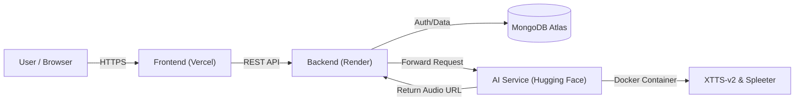

# 🎵 Audio.io – Next-Gen AI Audio Synthesis


> **Experience the power of Generative AI. Clone voices with high fidelity and separate music stems instantly.**

---

## 🚀 Overview

**Audio.io** is a cutting-edge full-stack application that bridges the gap between modern web technologies and state-of-the-art AI models. Unlike wrapper tools that rely on paid APIs, Audio.io runs its own **custom-containerized AI microservice**.

It features **Zero-Shot Text to Speech** (using Coqui XTTS-v2) and **Music Source Separation** (using Deezer Spleeter), all wrapped in a sleek, responsive React interface.

---

## ✨ Key Features

### 🎙️ AI (TTS)
* **Text-to-Speech:** Convert text into lifelike speech.
* **Powered by:** Coqui XTTS-v2.

### 🎸 AI Vocal Remover (Stem Separation)
* **Music Deconstruction:** Upload any song to split it into distinct tracks.
* **Outputs:** Isolated Vocals (`.wav`) and Accompaniment (`.wav`).
* **Powered by:** Spleeter (2-stems).

### 🔐 Secure & Scalable
* **Authentication:** Robust Login/Signup system with JWT and Google OAuth.
* **Cloud Architecture:** Distributed microservices communicating over secure APIs.
* **History:** MongoDB database tracks user generation history.

---

## 🏗️ The Architecture (DevOps)

This project demonstrates a complex **Split-Cloud Deployment Strategy** to maximize performance and stay within free-tier limits:



---

## 🛠️ Tech Stack

### 🎨 Frontend

* **Framework:** React (Vite)
* **Styling:** Tailwind CSS + Framer Motion
* **State:** React Hooks & Context API

### 🔌 Backend API

* **Runtime:** Node.js & Express.js
* **Database:** MongoDB Atlas
* **Auth:** JWT & Google OAuth 2.0

### 🤖 AI Microservice

* **Framework:** FastAPI
* **Models:** Coqui XTTS-v2, Spleeter
* **Container:** Docker

### ☁️ Deployment

* **Frontend:** Vercel
* **Backend:** Render
* **AI Engine:** Hugging Face Spaces
---

## ⚡ Local Installation Guide

Want to run this locally? You will need **3 terminal windows** open (one for each service).

### Prerequisites
* Node.js & npm
* Python 3.10+
* **FFmpeg** (Must be installed and added to system PATH)

### 1. Setup Backend
```bash
cd backend
npm install
# Create a .env file (see below)
npm run dev
```
### 2. Setup AI Service
```bash
cd ai-service
pip install -r requirements.txt
# Run the FastAPI server
uvicorn main:app --reload --port 8000
```

### 3. Setup Frontend
```bash
cd frontend
npm install
npm run dev
```
---

## Environment Variables
You need to create a .env file in both the backend and frontend directories.

### Backend (backend/.env)
```bash
PORT=5000
MONGO_URI=your_mongodb_connection_string
JWT_SECRET=your_secret_key
AI_SERVICE_URL=http://localhost:8000
FRONTEND_URL=http://localhost:5173
```

### Frontend (frontend/.env)
```bash
VITE_API_URL=http://localhost:5000
```
---

## Author 👨‍💻
Made with ❤️ by **Pranav**  
📧 Email: [pranavharad64@gmail.com](mailto:pranavharad64@gmail.com)  
🔗 LinkedIn: [www.linkedin.com/in/pranav-harad-667070268](https://www.linkedin.com/in/pranav-harad-667070268)

